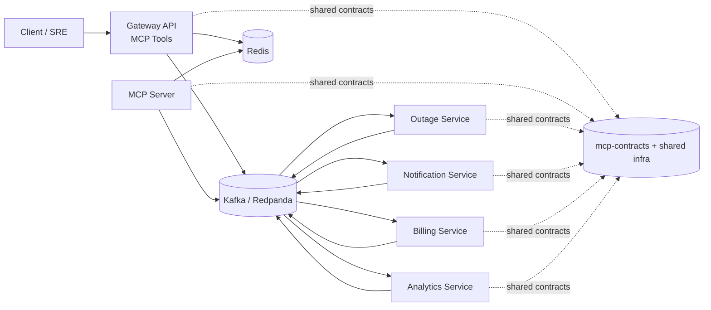

# MCP-Based Outage Processing Architecture

## High-level diagram

## Services
- **gateway**: API ingress + MCP tool surface.
- **mcp-server**: dedicated MCP server with tool endpoints for publish/trace/retry workflows.
- **outage-service**: validates outage requests.
- **notification-service**: customer and internal fan-out notifications.
- **billing-service**: computes credits and billing adjustments.
- **analytics-service**: aggregates metrics and trend analysis.

## Shared packages
- **mcp-contracts**: common envelope and event contract definitions.
- **shared**: Kafka, Redis, and observability helpers.

## Event flow
1. Gateway receives outage request and wraps it in `McpEnvelope<T>`.
2. Gateway publishes `outage.created` to Kafka.
3. Downstream services consume, process, and optionally publish derived events.
4. MCP server tools support operational workflows: publish, trace correlation, and retry failed events.
